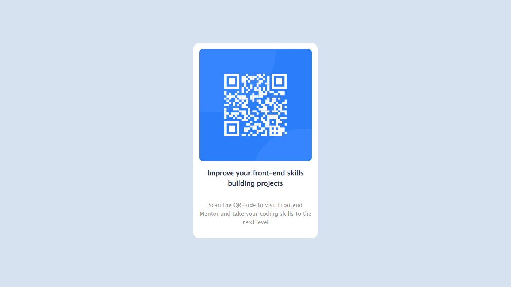

# Frontend Mentor - QR code component solution

This is a solution to the [QR code component challenge on Frontend Mentor](https://www.frontendmentor.io/challenges/qr-code-component-iux_sIO_H).

### Screenshot

### Links

- Solution URL: https://qrcode560.netlify.app/
- Live Site URL: https://github.com/Zish303/qr_code_component

### Built with

- HTML5
- CSS3
- Flexbox

## Author

- Website - [Mohammad Zishan](https://mohdzishan.netlify.app/)
- Frontend Mentor - [@Zish303](https://www.frontendmentor.io/profile/Zish303)
